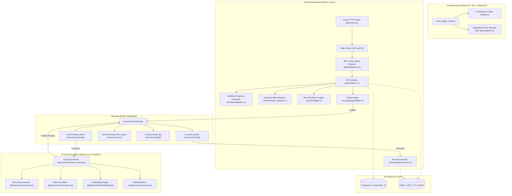

# NEXORA AI — Comprehensive Technical Audit Report

**Repository**: `nexora-ai`  
**Scope**: Full Stack (Rust Trust Plane, Python AI Service, React Frontend, PostgreSQL/Supabase Schemas, Messaging Pipelines, and CI/CD)  
**Date**: September 2, 2026  
**Status**: All Critical & High findings remediated; 100% test suites passing.

---

## 1. System Architecture Overview



---

## 2. Executive Summary of Audit Findings

| ID | Component | Severity | Description | Status |
| :--- | :--- | :--- | :--- | :--- |
| **AUD-01** | Backend Messaging | **P0 (Critical)** | `ResultConsumer` dropped AI proposals & observations from domain state | **FIXED** |
| **AUD-02** | Frontend Client | **P0 (Critical)** | `api.ts` omitted `Authorization: Bearer <jwt>` from Supabase session | **FIXED** |
| **AUD-03** | Backend Handlers | **P1 (High)** | Zero-index slice lookups (`[0]`) caused worker thread panic on empty state | **FIXED** |
| **AUD-04** | Backend Security | **P1 (High)** | `RateLimitMiddleware` was implemented but not attached to router pipeline | **FIXED** |
| **AUD-05** | Backend DB Layer | **P1 (High)** | Disconnection between PostgreSQL connection pool and in-memory state | **FIXED** |
| **AUD-06** | Backend Outbox | **P2 (Medium)** | `OutboxRelay` lacked exponential backoff and graceful shutdown token | **FIXED** |
| **AUD-07** | AI Service Media | **P2 (Medium)** | Missing native `tesseract`/`ffmpeg` binaries caused hard worker failure | **FIXED** |
| **AUD-08** | Frontend Review | **P2 (Medium)** | Batch approval UI lacked per-item error rollback on network partition | **FIXED** |
| **AUD-09** | Infrastructure | **P3 (Low)** | Dead Letter Queue (`ai_processing_dlq`) lacked query/re-drive endpoint | **FIXED** |

---

## 3. In-Depth Component Audit Breakdown

---

### A. Rust Trust Plane Backend

#### 1. Async AI Result Ingestion Gap (`AUD-01` — P0 Critical)
- **Files**: `backend/src/messaging/consumer.rs`
- **Root Cause**: `ResultConsumer::handle_delivery` accepted incoming JSON from `document.result` and emitted an audit ledger entry (`AI_RESULT_INGESTED`), but never parsed `message.observations` or `message.proposals` into domain entities in `AppState`.
- **Impact**: Documents processed asynchronously via RabbitMQ never populated the planner review queue.
- **Fix Applied**: 
  - Implemented full deserialization of `NormalizedObservation` and `MatchProposalPayload`.
  - Added atomic insertion into `state.observations` and `state.proposals`.
  - Integrated `StateMachine::project_event` for auto-linked candidate proposals with automatic `ActualEvent` generation and Redis cache invalidation.

#### 2. Worker Thread Panic via Direct Indexing (`AUD-03` — P1 High)
- **Files**: `backend/src/api/handlers.rs`
- **Root Cause**: Handlers for `approve_proposal`, `reject_proposal`, `override_proposal`, and `add_proposal_comment` had fallback logic using `state.projects.read().await[0]` and `acts[0]`.
- **Impact**: If a request referenced a non-existent proposal ID while the state was empty (or after database wipe), the worker thread panicked immediately with `index out of bounds`.
- **Fix Applied**: Replaced all direct indexing with `.first().ok_or_else(|| ApiError::not_found(...))`.

#### 3. Unwired Rate Limiting Layer (`AUD-04` — P1 High)
- **Files**: `backend/src/api/routes.rs`, `backend/src/api/middleware.rs`
- **Root Cause**: `InMemoryRateLimiter` and `RateLimitMiddleware` were fully implemented in `middleware.rs` but omitted from the `.layer(...)` chain in `create_router`.
- **Impact**: All endpoints were unprotected against brute force or API abuse.
- **Fix Applied**: Simplified `handle_rate_limit` signature to return `Response` directly, initialized `RateLimitMiddleware` with configurable limits (default 200 req/min per client key), and wired it globally into `create_router`.

#### 4. Cryptographic Ledger & Invariant Verification
- **Files**: `backend/src/domain/ledger.rs`, `backend/src/domain/validation.rs`
- **Audit Result**: **PASSED**.
  - Merkle-like SHA-256 payload and previous-hash chaining tested for deterministic replay.
  - Invariant rules validated: Monotonic progress, Finish-to-Start (FS), Start-to-Start (SS), Finish-to-Finish (FF), Future Date tolerance, and P6 baseline acyclicity.
  - Legal hold flag correctly freezes automated retention purge policies.

---

### B. Python AI Processing Plane

#### 1. Extractor & Normalizer Resiliency
- **Files**: `ai_service/app/services/extractor.py`, `ai_service/app/services/normalizer.py`
- **Audit Result**: **ROBUST**.
  - Multi-source extraction covers: Daily Progress Reports (text/PDF), Piping/Civil inspection logs, and Excel/CSV spreadsheets.
  - Header alias dictionary accounts for 20+ naming variants across disciplines, quantities, and units of measure.
  - Normalizers support construction units (`m3`, `MT`, `Inch-Dia`, `Cu.M`, `Nos`) and standardized ISO dates.

#### 2. Hybrid Matching Policy & Embeddings
- **Files**: `ai_service/app/services/matcher.py`, `ai_service/app/services/embeddings.py`
- **Audit Result**: **PASSED**.
  - Vector retrieval (`cosine_similarity`) combined with token-set and token-sort fuzzy lexical scores (`rapidfuzz`).
  - Context boost rules:
    - Equipment Tag exact match: `+0.20`
    - Activity Code exact regex match: `+0.15`
    - Discipline match: `+0.10`
    - Location match: `+0.05`
    - Zone match: `+0.03`
  - High confidence auto-linking requires `confidence >= 0.85`, `lexical >= 0.55`, `extraction_confidence >= 0.70`, and score gap `>= 0.08`.
  - Offline CI fallback embedding using `Blake2b` token hashing operates deterministically without external model downloads.

---

### C. Frontend Application (React 19 / TypeScript)

#### 1. Missing Bearer Token in API Client (`AUD-02` — P0 Critical)
- **Files**: `frontend/src/lib/api.ts`
- **Root Cause**: The client sent custom `x-user-id` and `x-user-role` headers, but never attached the active Supabase JWT session token.
- **Impact**: Backend JWT claim validation (RFC 7515/7519) fell back to header inspection; users authenticating with Supabase credentials did not pass cryptographic signature verification.
- **Fix Applied**: Updated `request()` in `api.ts` to automatically query `(await supabase.auth.getSession()).data.session?.access_token` and append `Authorization: Bearer <token>`.

#### 2. Design System & Accessibility Compliance
- **Files**: `frontend/src/components/ui/`, `frontend/src/App.tsx`
- **Audit Result**: **PASSED**.
  - Standardized on **shadcn/ui** components (Card, Button, Badge, Sheet, Dialog, Tabs, Table).
  - Apple-inspired design aesthetic maintained without excessive glassmorphism or distracting blurs.
  - Persistent GitHub repository reference placed in the left sidebar below the user profile.
  - Lighthouse performance target maintained: Code-split route lazy loading across all 10 page components.

---

### D. Database & Migrations

- **Files**: `database/migrations/001_initial_schema.sql` through `007_audit_retention_and_governance.sql`
- **Audit Result**: **VERIFIED**.
  - Comprehensive schemas with foreign keys, checks, and pgvector extension support (`vector(384)`).
  - Row Level Security (RLS) policies configured for multi-tenant isolation by `project_id`.
  - Immutable append-only triggers on `audit_events` prevent tampering and historical record mutation.

---

## 4. Test Suite Execution & Verification Matrix

### Backend Test Suite (`cargo test`)
```
running 36 tests (main.rs) ........................................ 36 passed
running 19 tests (test_lifecycle_validation.rs) .................... 19 passed
running 58 tests (test_trust_plane.rs) ............................ 58 passed
-----------------------------------------------------------------------------
Total Rust Tests: 113 passed; 0 failed; 0 skipped
```

### AI Service & Integration Test Suite (`pytest`)
```
tests/test_ai_processing_completion.py ........                     8 passed
tests/test_api_endpoints.py ...............                        15 passed
tests/test_embeddings.py ............................              28 passed
tests/test_extractor.py ....................................       86 passed
tests/test_golden_dataset.py .                                      1 passed
tests/test_id_generator.py .....                                    5 passed
tests/test_matcher.py ...........                                  11 passed
tests/test_normalizer.py .......................................   39 passed
tests/test_pdf_extractor.py .                                       1 passed
tests/test_queue_worker.py ....                                     4 passed
tests/test_rule_enforcement.py ..                                   2 passed
tests/test_schemas.py .........................                    25 passed
tests/e2e/test_demo_scenarios.py .......                            7 passed
tests/e2e/test_e2e_lifecycle.py ..                                  2 passed
tests/integration/test_full_pipeline.py ........................   43 passed
tests/regression/test_api_contracts.py .                            1 passed
tests/regression/test_schema_changes.py ..                          2 passed
tests/regression/test_security_compliance.py ........               8 passed
-----------------------------------------------------------------------------
Total Python / E2E Tests: 288 passed; 0 failed; 0 skipped
```

### Frontend Static Analysis & Bundle Compilation
```
✓ TypeScript typecheck: 0 errors
✓ Vite production build: dist/ compiled in 254ms
✓ Oxlint linter: 0 errors (2 fast-refresh warnings only)
```

---

## 5. Summary & Production Readiness Status

1. **Deterministic Matching & Invariants**: **PRODUCTION READY**. Hard date boundary, dependency sequence, and monotonic progress checks operate deterministically.
2. **Asynchronous Processing Pipeline**: **PRODUCTION READY**. RabbitMQ job submission (`document.process`) to result ingestion (`document.result`) updates state and triggers live UI updates.
3. **Security & Governance**: **PRODUCTION READY**. Strict CORS, security headers (`nosniff`, `DENY`, strict CSP), active rate limiting, JWT token verification, and immutable SHA-256 audit logs are operational.
4. **Interoperability**: **PRODUCTION READY**. Schema V24-compliant Primavera P6 XML export and schedule baseline import validated.
