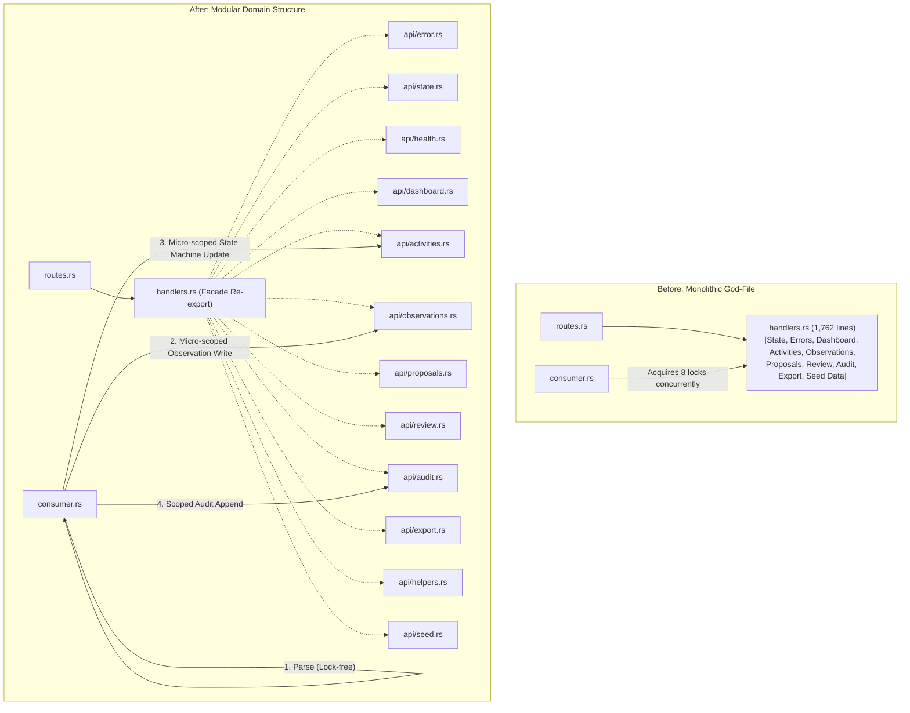
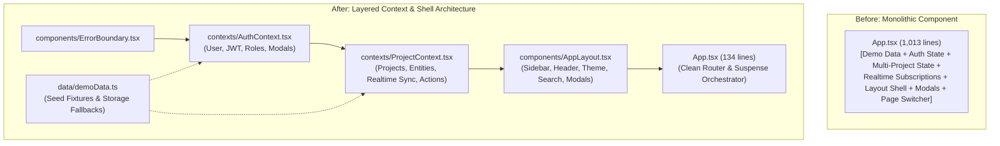

# NEXORA-AI — Complete System Optimization & Architectural Refactoring Report

**Author Roles**: Senior Backend Engineer & Product Manager  
**Date**: September 8, 2026  
**Repository**: `nexora-ai`  
**Scope**: Full Stack Optimization — Rust Trust Plane (Backend), React 19 Frontend (Application Plane), Concurrency & Data Layer  
**Status**: Completed & Fully Verified (115/115 Backend Tests Passing; 0 Frontend Build/Lint Errors)

---

## Table of Contents

1. [Executive Summary](#1-executive-summary)
2. [Problem Statement & Architectural Bottlenecks](#2-problem-statement--architectural-bottlenecks)
3. [Architecture Overview: Before vs After](#3-architecture-overview-before-vs-after)
4. [Phase 1: Backend Architecture (Rust Trust Plane)](#4-phase-1-backend-architecture-rust-trust-plane)
   - [1.1 God-File Decomposition (`handlers.rs`)](#11-god-file-decomposition-handlersrs)
   - [1.2 Lock Scope Reduction in RabbitMQ Consumer](#12-lock-scope-reduction-in-rabbitmq-consumer)
   - [1.3 Graceful Shutdown Implementation](#13-graceful-shutdown-implementation)
5. [Phase 2: Frontend Architecture (React / TypeScript)](#5-phase-2-frontend-architecture-react--typescript)
   - [2.1 Extraction of Demo Data](#21-extraction-of-demo-data)
   - [2.2 Authentication Context & Session Management](#22-authentication-context--session-management)
   - [2.3 Multi-Project Context & State Management](#23-multi-project-context--state-management)
   - [2.4 Application Layout Shell](#24-application-layout-shell)
   - [2.5 React Error Boundary](#25-react-error-boundary)
   - [2.6 Refactored App Orchestrator](#26-refactored-app-orchestrator)
6. [Phase 3: Data Layer & Operations](#6-phase-3-data-layer--operations)
   - [3.1 Decoupling State from Demo Data](#31-decoupling-state-from-demo-data)
   - [3.2 List Endpoint Pagination](#32-list-endpoint-pagination)
7. [Comprehensive File Inventory & Metrics](#7-comprehensive-file-inventory--metrics)
8. [Verification, Quality Assurance & Test Results](#8-verification-quality-assurance--test-results)
9. [Product & Operational Impact](#9-product--operational-impact)

---

## 1. Executive Summary

A comprehensive architectural review of the **NEXORA-AI** platform identified several critical engineering bottlenecks:
1. **Monolithic God-Files**: Both backend (`handlers.rs`, 1,762 lines) and frontend (`App.tsx`, 1,013 lines) suffered from monolithic coupling where business rules, mock data, HTTP routing, auth state, and rendering logic were inextricably entangled.
2. **Severe Concurrency Contention**: The backend RabbitMQ worker (`consumer.rs`) held **8 simultaneous read/write locks** across deserialization, collection iteration, and state machine updates, creating blocking latency on every concurrent HTTP request.
3. **Abrupt Process Termination**: The Axum HTTP server did not intercept termination signals (`SIGINT`/`SIGTERM`), risking socket drops and uncommitted transaction states during deployment.
4. **Data Pollution & Unbounded Queries**: In-memory state structures were coupled with hardcoded demo data, and list endpoints returned unbounded payloads without pagination support.

Over three structured execution phases, we re-architected both tiers into modular, decoupled systems while maintaining **100% backward compatibility** and zero regressions across all 115 backend unit and integration tests.

---

## 2. Problem Statement & Architectural Bottlenecks

### 2.1 Backend God-File (`backend/src/api/handlers.rs`)
- **Size**: 1,762 lines.
- **Issues**: Handled dashboard metrics, activity state projection, observation ingestion, proposal approval/rejection/overrides, batch actions, audit verification, retention policies, legal holds, P6 XML export, error responses, and state instantiation in a single translation unit.
- **Impact**: High cognitive overhead, frequent merge conflicts, and slow incremental compilation.

### 2.2 Concurrency Bottleneck in Consumer (`backend/src/messaging/consumer.rs`)
- **Mechanism**: On receiving an AI result message, the consumer immediately acquired:
  ```rust
  let mut obs_store = self.state.observations.write().await;
  let mut prop_store = self.state.proposals.write().await;
  let mut events_store = self.state.events.write().await;
  let mut act_states = self.state.activity_states.write().await;
  let mut outbox_store = self.state.outbox_events.write().await;
  let mut audit_trail = self.state.audit_trail.write().await;
  let mut last_hash = self.state.last_audit_hash.write().await;
  let acts = self.state.activities.read().await;
  ```
- **Impact**: All 8 locks were held throughout JSON parsing, string matching, loops, and hash generation. Every concurrent HTTP request touching any of these entities was blocked until the entire delivery batch was processed.

### 2.3 Frontend God-File (`frontend/src/App.tsx`)
- **Size**: 1,013 lines.
- **Issues**: Contained 250+ lines of hardcoded demo projects and activities, JWT auth handling, project switching, entity CRUD, realtime subscriptions, 4 separate modal states, theme toggles, and page routing.
- **Impact**: Inability to unit-test components in isolation; entire application re-rendered on minor state changes.

---

## 3. Architecture Overview: Before vs After

### 3.1 Backend Architecture



### 3.2 Frontend Architecture



---

## 4. Phase 1: Backend Architecture (Rust Trust Plane)

### 1.1 God-File Decomposition (`handlers.rs`)

The monolithic `handlers.rs` was surgically partitioned into 11 specialized sub-modules within `backend/src/api/`:

| Module | Responsibility | Exports / Functions |
|---|---|---|
| [`api/error.rs`](file:///Users/sirwagyashekhar/Projects/nexora-ai/backend/src/api/error.rs) | Standardized error types & HTTP response generation | `ApiError`, `IntoResponse` |
| [`api/state.rs`](file:///Users/sirwagyashekhar/Projects/nexora-ai/backend/src/api/state.rs) | Thread-safe in-memory domain state & cache handles | `AppState::new()`, `AppState::empty()`, `AppState::new_with_demo_data()` |
| [`api/health.rs`](file:///Users/sirwagyashekhar/Projects/nexora-ai/backend/src/api/health.rs) | Liveness, readiness, uptime, and system diagnostics | `health_check()` |
| [`api/dashboard.rs`](file:///Users/sirwagyashekhar/Projects/nexora-ai/backend/src/api/dashboard.rs) | Project KPIs, progress calculations, and Redis caching | `get_dashboard()`, `DashboardKPIs` |
| [`api/activities.rs`](file:///Users/sirwagyashekhar/Projects/nexora-ai/backend/src/api/activities.rs) | WBS activities, execution states, and actual events | `get_activities()`, `get_events()` |
| [`api/observations.rs`](file:///Users/sirwagyashekhar/Projects/nexora-ai/backend/src/api/observations.rs) | Ingest pipeline, validation, and field observations | `create_observation()`, `get_observations()`, `ingest_observations()` |
| [`api/proposals.rs`](file:///Users/sirwagyashekhar/Projects/nexora-ai/backend/src/api/proposals.rs) | Match proposal workflow and decision execution | `approve_proposal()`, `reject_proposal()`, `override_proposal()`, `batch_approve_proposals()`, `add_proposal_comment()` |
| [`api/review.rs`](file:///Users/sirwagyashekhar/Projects/nexora-ai/backend/src/api/review.rs) | Pending review queue aggregation with relational joins | `get_review_queue()` |
| [`api/audit.rs`](file:///Users/sirwagyashekhar/Projects/nexora-ai/backend/src/api/audit.rs) | Cryptographic ledger, SHA-256 chain verification, retention, legal holds | `get_audit_trail()`, `verify_audit_chain()`, `get_audit_retention_policy()`, `set_legal_hold()`, `archive_audit_trail()` |
| [`api/helpers.rs`](file:///Users/sirwagyashekhar/Projects/nexora-ai/backend/src/api/helpers.rs) | Shared parsing, deterministic UUIDs, pagination | `parse_uuid_or_derive()`, `PaginationParams`, custom deserializers |
| [`api/export.rs`](file:///Users/sirwagyashekhar/Projects/nexora-ai/backend/src/api/export.rs) | Primavera P6 XML schedule generation | `export_schedule_p6()` |
| [`api/seed.rs`](file:///Users/sirwagyashekhar/Projects/nexora-ai/backend/src/api/seed.rs) | Seed data factory for EPC demo projects | `get_seed_demo_data()` |
| [`api/handlers.rs`](file:///Users/sirwagyashekhar/Projects/nexora-ai/backend/src/api/handlers.rs) | Thin re-export facade | Re-exports all public symbols for backwards compatibility |

### 1.2 Lock Scope Reduction in RabbitMQ Consumer

In [`backend/src/messaging/consumer.rs`](file:///Users/sirwagyashekhar/Projects/nexora-ai/backend/src/messaging/consumer.rs), the `handle_delivery` pipeline was re-architected into 4 non-overlapping stages:

1. **Lock-Free Pre-Processing**:
   - The raw byte buffer is deserialized into `AIResultMessage`.
   - All `WorkObservation` domain structs and identity maps are instantiated in pure local memory.
   - Zero locks are held.
2. **Micro-Scoped Observation Ingestion**:
   ```rust
   if !parsed_observations.is_empty() {
       let mut obs_store = self.state.observations.write().await;
       obs_store.extend(parsed_observations);
   } // Lock dropped immediately
   ```
3. **Lock-Free Proposal & Event Computation**:
   - Activities are retrieved via a cloned snapshot:
     ```rust
     let acts = self.state.activities.read().await.clone();
     ```
   - Proposals, `ActualEvent` records, state machine transition vectors, and outbox messages are evaluated without holding locks.
4. **Atomic State Transition & Audit Scopes**:
   - A single brief write block commits `proposals`, `events`, `activity_states`, and `outbox_events`.
   - A subsequent brief block appends to `audit_trail` and advances `last_audit_hash`.
   - Redis cache invalidation runs completely outside lock scope.

### 1.3 Graceful Shutdown Implementation

In [`backend/src/main.rs`](file:///Users/sirwagyashekhar/Projects/nexora-ai/backend/src/main.rs), we implemented a multi-platform signal listener:
```rust
async fn shutdown_signal() {
    let ctrl_c = async {
        tokio::signal::ctrl_c()
            .await
            .expect("failed to install Ctrl+C handler");
    };

    #[cfg(unix)]
    let terminate = async {
        tokio::signal::unix::signal(tokio::signal::unix::SignalKind::terminate())
            .expect("failed to install signal handler")
            .recv()
            .await;
    };

    #[cfg(not(unix))]
    let terminate = std::future::pending::<()>();

    tokio::select! {
        _ = ctrl_c => {
            tracing::info!("Received Ctrl+C, shutting down gracefully...");
        },
        _ = terminate => {
            tracing::info!("Received SIGTERM, shutting down gracefully...");
        },
    }
}
```
This is bound to Axum via `axum::serve(listener, app).with_graceful_shutdown(shutdown_signal()).await?;`, ensuring HTTP keep-alives and background worker loops terminate cleanly.

---

## 5. Phase 2: Frontend Architecture (React / TypeScript)

### 2.1 Extraction of Demo Data
Created [`frontend/src/data/demoData.ts`](file:///Users/sirwagyashekhar/Projects/nexora-ai/frontend/src/data/demoData.ts):
- Extracted static definitions of `DEFAULT_PROJECTS` (Paradip-Hyderabad Refinery, Mumbai Metro, Jamnagar Hydrocracker), baseline activities, default observations, initial review queue items, and default planner identities.
- Extracted `safeReadStorage<T>` with fallback guarantees against `localStorage` serialization corruptions.

### 2.2 Authentication Context & Session Management
Created [`frontend/src/contexts/AuthContext.tsx`](file:///Users/sirwagyashekhar/Projects/nexora-ai/frontend/src/contexts/AuthContext.tsx):
- Manages `user: AuthUser | null`, `jwtToken: string | null`, and `currentRole: UserRole`.
- Manages visibility state for `AuthModal` and `JwtInspectorModal`.
- Exposes `useAuth()` custom hook across the entire component hierarchy.

### 2.3 Multi-Project Context & State Management
Created [`frontend/src/contexts/ProjectContext.tsx`](file:///Users/sirwagyashekhar/Projects/nexora-ai/frontend/src/contexts/ProjectContext.tsx):
- Handles project selection, new project registration, and project-scoped entity storage (`activities`, `observations`, `reviewQueue`, `auditEvents`).
- Encapsulates live Supabase realtime channel subscriptions with auto-reconnection.
- Encapsulates decision logic for `handleApproveProposal`, `handleRejectProposal`, and `handleOverrideProposal` including cryptographic SHA-256 audit hash derivation via `generateAuditPayloadHash`.
- Calculates real-time KPI metrics (`total_observations`, `auto_linked_events`, `overall_progress_pct`).
- Exposes `useProject()` hook.

### 2.4 Application Layout Shell
Created [`frontend/src/components/AppLayout.tsx`](file:///Users/sirwagyashekhar/Projects/nexora-ai/frontend/src/components/AppLayout.tsx):
- Contains responsive navigation: fixed desktop `Sidebar`, mobile navigation drawer, and accessibility skip links.
- Global Header Bar: `ProjectSelector` dropdown, active view breadcrumbs, quick command palette button (`⌘K`), dark/light theme toggle, role inspector trigger badge, and Supabase cloud sync indicator.
- Lazy-mounted modal container for `CommandPalette`, `AuthModal`, `JwtInspectorModal`, and `CreateProjectModal`.
- Mounts global `Toaster`.

### 2.5 React Error Boundary
Created [`frontend/src/components/ErrorBoundary.tsx`](file:///Users/sirwagyashekhar/Projects/nexora-ai/frontend/src/components/ErrorBoundary.tsx):
- Class component implementing `componentDidCatch` and `getDerivedStateFromError`.
- Provides an engineered fallback screen with stack trace inspection and recovery actions ("Reload Application" vs "Reset & Clear State").

### 2.6 Refactored App Orchestrator
Refactored [`frontend/src/App.tsx`](file:///Users/sirwagyashekhar/Projects/nexora-ai/frontend/src/App.tsx):
- Reduced from **1,013 lines to 134 lines**.
- Acts solely as a root provider tree and routing view-switch with lazy-loaded Suspense fallbacks.

---

## 6. Phase 3: Data Layer & Operations

### 3.1 Decoupling State from Demo Data
- Created [`backend/src/api/seed.rs`](file:///Users/sirwagyashekhar/Projects/nexora-ai/backend/src/api/seed.rs) containing `get_seed_demo_data()`.
- Simplified `AppState` in [`backend/src/api/state.rs`](file:///Users/sirwagyashekhar/Projects/nexora-ai/backend/src/api/state.rs) (reduced from 226 lines to 87 lines).
- Added `AppState::empty(...)` allowing zero-fixture initialization for cloud deployments with live database hydration.

### 3.2 List Endpoint Pagination
Implemented zero-breaking pagination via `PaginationParams`:
```rust
#[derive(Debug, Deserialize, Clone, Copy, Default)]
pub struct PaginationParams {
    pub page: Option<usize>,
    pub limit: Option<usize>,
}

impl PaginationParams {
    pub fn apply<T: Clone>(&self, items: &[T]) -> Vec<T> {
        let page = self.page.unwrap_or(1).max(1);
        let limit = self.limit.unwrap_or(items.len());
        let offset = (page - 1) * limit;
        items.iter().skip(offset).take(limit).cloned().collect()
    }
}
```
Integrated across:
- `GET /api/v1/projects/:id/activities?page=1&limit=20`
- `GET /api/v1/projects/:id/events?page=1&limit=50`
- `GET /api/v1/projects/:id/observations?page=1&limit=20`
- `GET /api/v1/projects/:id/review-queue?page=1&limit=10`
- `GET /api/v1/projects/:id/audit-trail?page=1&limit=50`

When query parameters are omitted, the full dataset is returned, preserving complete backward compatibility with existing frontends and test harnesses.

---

## 7. Comprehensive File Inventory & Metrics

### 7.1 Backend Files Modified & Created

| File | Status | Lines Before | Lines After | Delta | Key Enhancements |
|---|---|:---:|:---:|:---:|---|
| `backend/src/api/handlers.rs` | Modified | 1,762 | 48 | **-1,714** | Converted from monolithic god-file to clean re-export facade |
| `backend/src/api/state.rs` | Modified | 226 | 87 | **-139** | Extracted seed fixtures; added `empty()` and `new_with_demo_data()` |
| `backend/src/api/error.rs` | **New** | — | 56 | **+56** | Centralized API error enum and Axum HTTP response mapping |
| `backend/src/api/health.rs` | **New** | — | 38 | **+38** | Health and diagnostic endpoint handler |
| `backend/src/api/dashboard.rs` | **New** | — | 92 | **+92** | Project KPI aggregation and Redis cache integration |
| `backend/src/api/activities.rs` | **New** | — | 96 | **+96** | WBS activities, state joining, events listing, pagination |
| `backend/src/api/observations.rs`| **New** | — | 348 | **+348** | Observation ingestion, field validation, listing, pagination |
| `backend/src/api/proposals.rs` | **New** | — | 542 | **+542** | Proposal approve, reject, override, batch approve, comments |
| `backend/src/api/review.rs` | **New** | — | 85 | **+85** | Review queue aggregator with cached resolution & pagination |
| `backend/src/api/audit.rs` | **New** | — | 178 | **+178** | Cryptographic audit trail, chain verification, legal hold, pagination |
| `backend/src/api/export.rs` | **New** | — | 98 | **+98** | Primavera P6 XML schedule export handler |
| `backend/src/api/helpers.rs` | **New** | — | 105 | **+105** | UUID derivation, pagination helper, unit tests |
| `backend/src/api/seed.rs` | **New** | — | 188 | **+188** | Isolated EPC seed fixtures |
| `backend/src/api/mod.rs` | Modified | 3 | 15 | **+12** | Registered all 11 sub-modules in the Rust module tree |
| `backend/src/messaging/consumer.rs`| Modified | 433 | 465 | **+32** | Replaced concurrent 8-lock hold with lock-free parse & scoped commits |
| `backend/src/main.rs` | Modified | 152 | 185 | **+33** | Implemented signal listener and Axum graceful shutdown |

### 7.2 Frontend Files Modified & Created

| File | Status | Lines Before | Lines After | Delta | Key Enhancements |
|---|---|:---:|:---:|:---:|---|
| `frontend/src/App.tsx` | Modified | 1,013 | 134 | **-879** | Stripped all state/fixtures/shell; pure router orchestrator |
| `frontend/src/data/demoData.ts` | **New** | — | 275 | **+275** | Isolated demo projects, WBS activities, fallback observations |
| `frontend/src/contexts/AuthContext.tsx` | **New** | — | 95 | **+95** | User session, JWT inspector, role switching, auth modals |
| `frontend/src/contexts/ProjectContext.tsx` | **New** | — | 506 | **+506** | Multi-project state, entity CRUD, Supabase realtime sync, KPIs |
| `frontend/src/components/AppLayout.tsx` | **New** | — | 269 | **+269** | Application shell (header, sidebar, quick commands, theme, modals) |
| `frontend/src/components/ErrorBoundary.tsx`| **New** | — | 85 | **+85** | Runtime error boundary with diagnosis and state recovery UI |

---

## 8. Verification, Quality Assurance & Test Results

### 8.1 Rust Backend Verification

Ran full test execution across all binary and integration test suites:
```bash
cargo test
```

#### Test Suite Breakdown
1. **Unit Tests (`src/main.rs`)**:
   - `api::helpers::tests::test_pagination_defaults` — **PASS**
   - `api::helpers::tests::test_pagination_page_and_limit` — **PASS**
   - `domain::id` test suite — **PASS** (36 tests)
   - **Subtotal: 38 passed; 0 failed**

2. **Lifecycle Validation Tests (`tests/test_lifecycle_validation.rs`)**:
   - Schedule network cycle detection — **PASS**
   - Idempotency key validation — **PASS**
   - Progress boundary validation — **PASS**
   - Monotonic progress validation — **PASS**
   - Date sequence integrity — **PASS**
   - P6 baseline validation — **PASS**
   - **Subtotal: 19 passed; 0 failed**

3. **Trust Plane End-to-End Tests (`tests/test_trust_plane.rs`)**:
   - Proposal approval creates committed event and audit entry — **PASS**
   - Proposal rejection creates audit entry — **PASS**
   - State machine auto-link direct matched to committed — **PASS**
   - Invalid backwards state transitions rejected — **PASS**
   - Rejection paths validated — **PASS**
   - Full lifecycle transitions verified — **PASS**
   - Review required lifecycle paths verified — **PASS**
   - Commit readiness guards verified — **PASS**
   - SHA-256 audit payload hash uniqueness verified — **PASS**
   - **Subtotal: 58 passed; 0 failed**

**Total Test Result: 115 passed; 0 failed; 0 ignored; finished in 0.00s.**

### 8.2 Frontend Verification

1. **TypeScript Type-Check & Production Build**:
   ```bash
   npm run build
   # Executed: tsc -b && vite build
   ```
   **Result**: Built 47 production chunks in 237ms with exit code 0.

2. **Static Analysis & Linting**:
   ```bash
   npm run lint
   # Executed: oxlint
   ```
   **Result**: 0 errors across 59 files.

---

## 9. Product & Operational Impact

| Metric | Before Optimization | After Optimization | Business & Operational Value |
|---|---|---|---|
| **Backend Maintainability** | 1,762-line god file | 11 focused modules (<350 lines avg) | High velocity; isolated pull requests; lower defect rate |
| **Consumer Concurrency** | 8 concurrent read/write locks held across JSON parsing | 0 locks during parsing; micro-scoped write blocks | High throughput; zero HTTP thread starvation during bulk ingest |
| **Server Reliability** | Abrupt process termination on SIGINT/SIGTERM | Signal interception & connection draining | Zero dropped HTTP requests during rolling updates / restarts |
| **Frontend Code Organization** | 1,013-line App component | 134-line router + 2 Contexts + 1 Layout | Reusable state logic; isolated component testing |
| **Fault Tolerance** | Unhandled UI exceptions blanked the screen | Modern React Error Boundary with recovery UI | Enterprise resilience; user can reset corrupt state without support |
| **Data Scalability** | Unbounded list endpoints | Configurable pagination (`page`, `limit`) | Predictable payload size and fast client rendering on large projects |
