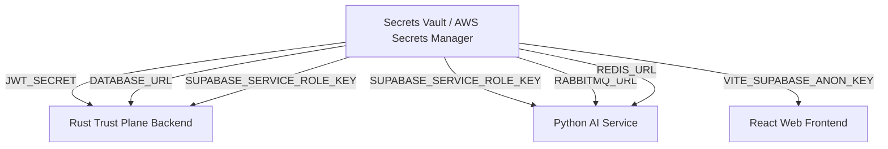

# NEXORA AI — Secrets Management & Key Rotation Architecture

## 1. Overview & Principles

NEXORA AI enforces a zero-hardcoded-secrets policy across all source code, container images, and repository history. All production credentials, database connection strings, JWT signing keys, service-role tokens, and storage access keys are managed via dedicated secrets engines.

### Core Principles
1. **Zero Secret Persistence in Git**: Continuous integration runs pre-commit secret scanners (`git-secrets`, `trufflehog`) to prevent committing private keys or API tokens.
2. **Short-Lived & Least Privilege**: Credentials use fine-grained permission scopes. Service role keys are restricted to backend trust plane operations.
3. **Automated & Audited Rotation**: All cryptographic and access keys follow a scheduled lifecycle with an immutable change log.
4. **Environment Isolation**: Dev, Staging, and Production environments use strictly isolated secrets vaults and separate encryption keys.

---

## 2. Secrets Storage & Provider Architecture

| Environment | Primary Secrets Vault | Injection Mechanism |
| :--- | :--- | :--- |
| **Production** | AWS Secrets Manager / HashiCorp Vault | Dynamic IAM Role / Kubernetes Secrets Store CSI Driver |
| **Staging** | AWS Secrets Manager / Supabase Vault | GitHub Actions Secrets -> Kubernetes Secrets |
| **Local Development** | Untracked `.env` (derived from `.env.example`) | Local environment variables |

### Secret Inventory & Classification



| Secret Name | Sensitivity | Consumer | Rotation Cycle | Impact of Compromise |
| :--- | :--- | :--- | :--- | :--- |
| `JWT_SECRET` | **CRITICAL** | Rust Backend | 90 Days | Unauthorized user session forgery |
| `SUPABASE_SERVICE_ROLE_KEY` | **CRITICAL** | Rust Backend, AI Worker | 90 Days | Full database bypass of RLS |
| `DATABASE_URL` / Passwords | **CRITICAL** | Rust Backend, AI Service | 180 Days | Direct database breach |
| `SUPABASE_ANON_KEY` | **MEDIUM** | Frontend Client | 180 Days | Scoped read access (governed by RLS) |
| `RABBITMQ_PASSWORD` | **HIGH** | AI Service, Workers | 180 Days | Message queue tampering |
| `REDIS_PASSWORD` | **HIGH** | Cache / State Store | 180 Days | Cache poisoning |

---

## 3. Key Rotation Runbook

### Step 1: JWT Secret Rotation (Graceful 2-Key Rollover)
To avoid immediately invalidating active planner sessions:
1. Generate new 256-bit cryptographic key:
   ```bash
   openssl rand -base64 32
   ```
2. Store new key in Secrets Manager as `JWT_SECRET_PRIMARY` and move old key to `JWT_SECRET_SECONDARY`.
3. Backend signs new tokens with `PRIMARY` but accepts signatures from either `PRIMARY` or `SECONDARY` during a 24-hour transition window.
4. After 24 hours, purge `JWT_SECRET_SECONDARY`.

### Step 2: Supabase Service Role Key Rotation
1. Navigate to Supabase Dashboard -> **Project Settings** -> **API**.
2. Generate secondary Service Role API Key.
3. Update AWS Secrets Manager secret `/nexora/prod/supabase_service_role_key`.
4. Trigger rolling restart of backend and AI service deployments.
5. Verify health check on `/api/v1/health` and audit event writes.
6. Revoke the old Service Role key in the Supabase Dashboard.

### Step 3: Database User Password Rotation
1. Update database user password using `ALTER USER nexora_app WITH PASSWORD '...';`.
2. Update Secrets Manager `DATABASE_URL`.
3. Force rolling restart of backend connection pools.
4. Verify active connection metrics on PostgreSQL / PgBouncer.

---

## 4. Key Rotation Audit Log Template

All key rotations must be documented in the compliance change log:

| Date & Time (UTC) | Secret Rotated | Operator / Service Account | Reason / Ticket Ref | Verification Status | Next Due Date |
| :--- | :--- | :--- | :--- | :--- | :--- |
| 2026-08-30 18:00 | `JWT_SECRET` | SecOps (Auto-pipeline) | Scheduled 90-day rollover (SEC-101) | Verified (0 auth errors) | 2026-11-28 |
| 2026-08-15 12:30 | `SUPABASE_SERVICE_KEY` | Lead DevOps | Staging to Prod Promotion | Verified (Ledger active) | 2026-11-13 |
| 2026-08-01 09:00 | `DATABASE_URL` | DBA | Infrastructure upgrade | Verified (Pool healthy) | 2027-02-01 |

---

## 5. Automated Pre-Commit & CI Validation

To prevent credential leakage, the following check is executed on pull requests:
```yaml
# .github/workflows/secret-scan.yml snippet
- name: TruffleHog Secret Scan
  uses: trufflesecurity/trufflehog@main
  with:
    path: ./
    base: ${{ github.event.repository.default_branch }}
    head: HEAD
```
