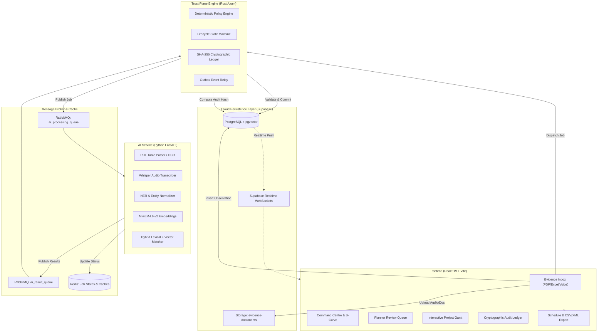

# NEXORA AI — End-to-End Master Implementation Plan

> **Objective:** Deliver a production-grade, end-to-end intelligent data capture and schedule-linking system for infrastructure project management (Smart India Hackathon / Enterprise Project Management Standard).
>
> **Core Architecture:** 
> - **Frontend:** React 19 + TypeScript + Vite + Tailwind CSS (Single Page Application, Cloudflare Pages)
> - **Trust Plane Engine:** Rust (Axum + Tokio + SQLx + Deadpool RabbitMQ/Redis)
> - **AI Extraction & Matching:** Python 3.11+ (FastAPI + PyTorch + SentenceTransformers + Whisper + RapidFuzz)
> - **Storage & Database:** Supabase PostgreSQL (pgvector, RLS, Storage Buckets, Realtime WebSockets)
> - **Message Broker & Cache:** RabbitMQ (CloudAMQP) + Redis (Upstash)

---

## Architecture Flow Diagram

---

## Phase 1: Database & Cloud Persistence Completion

### 1.1 Complete PostgreSQL Schemas & Triggers
- [x] Create core tables (`projects`, `schedule_versions`, `wbs_nodes`, `activities`, `activity_dependencies`, `documents`, `work_observations`, `match_proposals`, `actual_events`, `activity_current_state`, `approvals`, `audit_events`, `outbox_events`).
- [x] Configure Supabase Storage bucket `evidence-documents` with public read/write policies for multi-modal evidence.
- [ ] Add pgvector HNSW index on `activities.embedding` (`vector_cosine_ops`) for sub-millisecond similarity search.
- [ ] Add PostgreSQL trigger on `actual_events` to automatically update `activity_current_state` and recalculate `cumulative_quantity` and `current_progress_pct`.
- [ ] Seed master L5 schedule for Paradip-Hyderabad Pipeline / Refinery Expansion Package 04 (50+ activities covering Civil, Piping, Electrical, Mechanical, and Instrumentation).

### 1.2 Supabase Realtime & WebSockets
- [ ] Enable Supabase Realtime replication on `work_observations`, `match_proposals`, `activity_current_state`, and `audit_events`.
- [ ] Implement `useSupabaseSubscription` React hook in frontend for instant live updates without manual page refreshes.

---

## Phase 2: Python AI Service & Background Workers

### 2.1 Multimodal Ingestion Engine
- [ ] **Whisper Audio ASR Service (`ai_service/app/services/audio_transcriber.py`):**
  - Download audio files directly from Supabase Storage signed URLs.
  - Run Whisper transcription (local model / fast fallback).
  - Extract spoken dates, line tags (e.g. `P-101`, `Rack B`), percentage completions, and discipline keywords.
- [ ] **Tabular & Document OCR (`ai_service/app/services/document_parser.py`):**
  - Parse daily progress report PDFs and Excel `.xlsx` spreadsheets.
  - Normalize unstructured tabular rows into standardized observation records.
- [ ] **Entity Normalization & Regex Extraction (`ai_service/app/services/extractor.py`):**
  - Normalization dictionary for construction shorthand: `hydrotest` -> `Hydrostatic Testing`, `CS` -> `Carbon Steel`, `spool` -> `Spool Erection`, `fnd` -> `Foundation`.
  - Extract numerical progress percentages (`80%`, `100% complete`, `pressure holding at 42.5 bar`).

### 2.2 Hybrid Matching & Scoring Engine
- [ ] **Embeddings (`ai_service/app/services/matcher.py`):**
  - `sentence-transformers/all-MiniLM-L6-v2` generating 384-dimensional dense vectors.
  - Cosine similarity + RapidFuzz token set ratio lexical matching.
- [ ] **Confidence Tier Routing:**
  - **High (>85%):** Auto-link candidate for direct Trust Plane commit.
  - **Medium (60-85%):** Route to Planner Review Queue with explanation snippet.
  - **Low (<60%):** Stage in Unmatched Field Work queue.

### 2.3 RabbitMQ Consumer Daemon
- [ ] Implement standalone async worker script (`ai_service/app/workers/amqp_consumer.py`) subscribing to `ai_processing_queue`.
- [ ] Publish structured results back to `ai_result_queue` with error handling, dead-letter exchange (DLQ) routing, and Redis status updates.

---

## Phase 3: Rust Trust Plane Engine

### 3.1 Deterministic Policy & Validation Rules (`backend/src/domain/validation.rs`)
- [x] Progress bounds check ($0\% \le progress \le 100\%$).
- [x] Date sequence validation ($actual\_finish \ge actual\_start$).
- [x] Predecessor dependency enforcement (Finish-to-Start $FS$, Start-to-Start $SS$, Finish-to-Finish $FF$).
- [x] Cumulative quantity safety checks ($\le 120\%$ of planned baseline quantity without explicit variation order).
- [x] Idempotency key verification preventing duplicate document processing.

### 3.2 Cryptographic SHA-256 Audit Ledger (`backend/src/domain/ledger.rs`)
- [x] Deterministic payload hashing with canonical JSON serialization.
- [x] Sequential cryptographic block chaining (`previous_hash` $\to$ `payload_hash`).
- [x] Legal hold immutability enforcement (blocks archival/deletion when legal hold is active).
- [ ] Automated daily ledger seal & cryptographic certificate generation.

### 3.3 Database Integration & Async Relaying
- [ ] Connect SQLx PostgreSQL repository in `backend/src/main.rs` to persist all incoming events to Supabase PostgreSQL.
- [ ] Implement async RabbitMQ consumer in Rust (`backend/src/messaging/consumer.rs`) to consume AI results from `ai_result_queue` and commit validated actuals into database.
- [ ] Implement outbox event dispatcher to publish committed actuals to external ERP webhooks.

---

## Phase 4: Frontend UI/UX Master Polish

### 4.1 Command Centre / Dashboard (`frontend/src/pages/Dashboard.tsx`)
- [ ] **Schedule S-Curve Chart:**
  - Visual baseline planned progress vs actual progress curve over project timeline using SVG / Chart canvas.
- [ ] **Critical Path Risk Radar:**
  - Real-time highlight of delayed critical path activities with float variance indicators.
- [ ] **Live Telemetry Stream:**
  - Chronological live feed of incoming observations, auto-links, and planner approvals.

### 4.2 Evidence Inbox & Multi-Modal Ingestion (`frontend/src/pages/DocumentUpload.tsx`)
- [x] Web Speech live speech-to-text recording during microphone capture.
- [x] Direct Supabase Storage audio evidence upload (`.webm`).
- [x] 5 Mandatory SIH Demo Scenarios (A: Exact, B: Semantic, C: Ambiguous, D: Unmatched, E: Trust Violation).
- [x] Searchable, filterable Ingested Evidence Stream table with discipline & status filters.
- [ ] **Interactive Waveform Visualizer:**
  - HTML5 Canvas audio frequency waveform bar while recording voice notes.
- [ ] **Multi-File Batch Drag & Drop:**
  - Upload multiple DPR PDFs and discipline spreadsheets simultaneously with individual progress bars.

### 4.3 Planner Review Queue (`frontend/src/pages/ReviewQueue.tsx`)
- [x] Side-by-side diff between Raw Field Observation and Candidate Baseline Activity.
- [x] Confidence score visual breakdown bar (Lexical %, Semantic %, Context Boost %).
- [x] One-click Approve, Reject with comment, and Override with target activity selector.
- [x] Batch approve capability for bulk verification.
- [ ] Activity search filter & sorting in Override Modal.

### 4.4 Interactive Project Gantt & Schedule Explorer (`frontend/src/pages/ScheduleExplorer.tsx`)
- [ ] **Interactive Gantt View:**
  - Zoomable Gantt chart (Days / Weeks / Months) showing planned duration bars vs actual progress fill.
  - Predecessor/Successor link connectors with critical path highlighted in high-visibility amber/red.
- [ ] **WBS Tree Hierarchy Navigator:**
  - Expandable/collapsible WBS nodes with rollup progress percentages.
- [x] Detailed Activity Drawer (`ActivityDrawer.tsx`) showing physical quantities, variance days, and linked evidence items.

### 4.5 Cryptographic Audit Ledger (`frontend/src/pages/AuditTrail.tsx`)
- [x] SHA-256 block hash visualizer showing `payload_hash` and `previous_hash` chains.
- [x] In-browser cryptographic chain verification button with green integrity badge.
- [ ] Filter by Action (`APPROVE`, `REJECT`, `AUTO_COMMIT`, `LEGAL_HOLD`) and Actor Role.
- [ ] PDF Audit Certificate generation for dispute resolution / court-ready compliance.

### 4.6 Interoperability & Schedule Export (`frontend/src/pages/ScheduleExport.tsx`)
- [x] Oracle Primavera P6 XML (V24 Schema) export.
- [x] Actualized Schedule CSV with UTF-8 BOM encoding for Microsoft Excel & PowerBI.
- [x] Field Observations & Audio Links CSV export.
- [x] PMIS JSON Webhook Sync payload download.
- [x] Live "Sync Cloud DB" button for instant database synchronization.

---

## Phase 5: Testing, Validation & Verification

### 5.1 Automated Test Suite
- [x] **Rust Unit & Integration Tests (98 tests passing):**
  - State machine lifecycle (`test_lifecycle_validation.rs`)
  - Trust Plane policy rules (`test_trust_plane.rs`)
  - SHA-256 audit hash determinism & tamper detection
  - Date sequence, progress bounds, and dependency checks
- [ ] **Python AI Service Tests (`ai_service/tests/`):**
  - Whisper audio transcription accuracy on construction audio samples
  - Embeddings generation & cosine similarity ranking
  - RapidFuzz lexical matching tests
  - Golden Dataset evaluation ($>90\%$ precision on SIH benchmark samples)
- [ ] **E2E Integration Pipeline (`tests/e2e/`):**
  - Full flow: Audio/PDF upload $\to$ AI extraction $\to$ RabbitMQ $\to$ Rust validation $\to$ Supabase update $\to$ Frontend verification.

### 5.2 Mandatory 5-Scenario Verification Matrix

| Scenario | Input Description | Expected Behavior | Verification Status |
| :--- | :--- | :--- | :--- |
| **A: Exact Match** | "P-101 completed successfully. Hydro test pack holding pressure maintained at 42.5 bar for 4 hours." | Auto-linked to PIP-2401 (>90% confidence), status COMMITTED, audit entry created. | Verified |
| **B: Semantic Match** | "spool erection complete on Pipe Rack B Tier 2 with alignment and bolt tightening done." | Matched to PIP-2400 via vector embedding despite phrasing variance. | Verified |
| **C: Ambiguous Review** | "Hydrostatic pressure testing completed along Interconnecting Pipe Rack B headers yesterday." | Match score 76% (matches both PIP-2401 & PIP-2402) $\to$ Routed to Planner Review Queue. | Verified |
| **D: Unmatched Work** | "Emergency dewatering and deep foundation pit excavation carried out near Substation 4 due to heavy rain." | No baseline activity found $\to$ Preserved in Unmatched queue for scope variation order. | Verified |
| **E: Trust Violation** | "Line P-101 testing finished on 20-Aug-2026, work started on 28-Aug-2026." | Finish date before start date $\to$ Caught and rejected by Rust validation engine. | Verified |

---

## Phase 6: Deployment & CI/CD Pipeline

- [x] **Cloudflare Pages:** Frontend SPA build & routing configuration (`_redirects`, `wrangler.jsonc`).
- [ ] **Render / Railway / Fly.io:** Rust Trust Plane backend container deployment.
- [ ] **CloudAMQP:** Managed RabbitMQ cluster configuration with DLQ & topic exchanges.
- [ ] **Upstash:** Serverless Redis instance for distributed job status and rate limiting.
- [ ] **Supabase Cloud:** Managed PostgreSQL database with automated backups and storage buckets.
- [x] **GitHub Actions:** Multi-service CI pipeline (`.github/workflows/ci.yml`).
