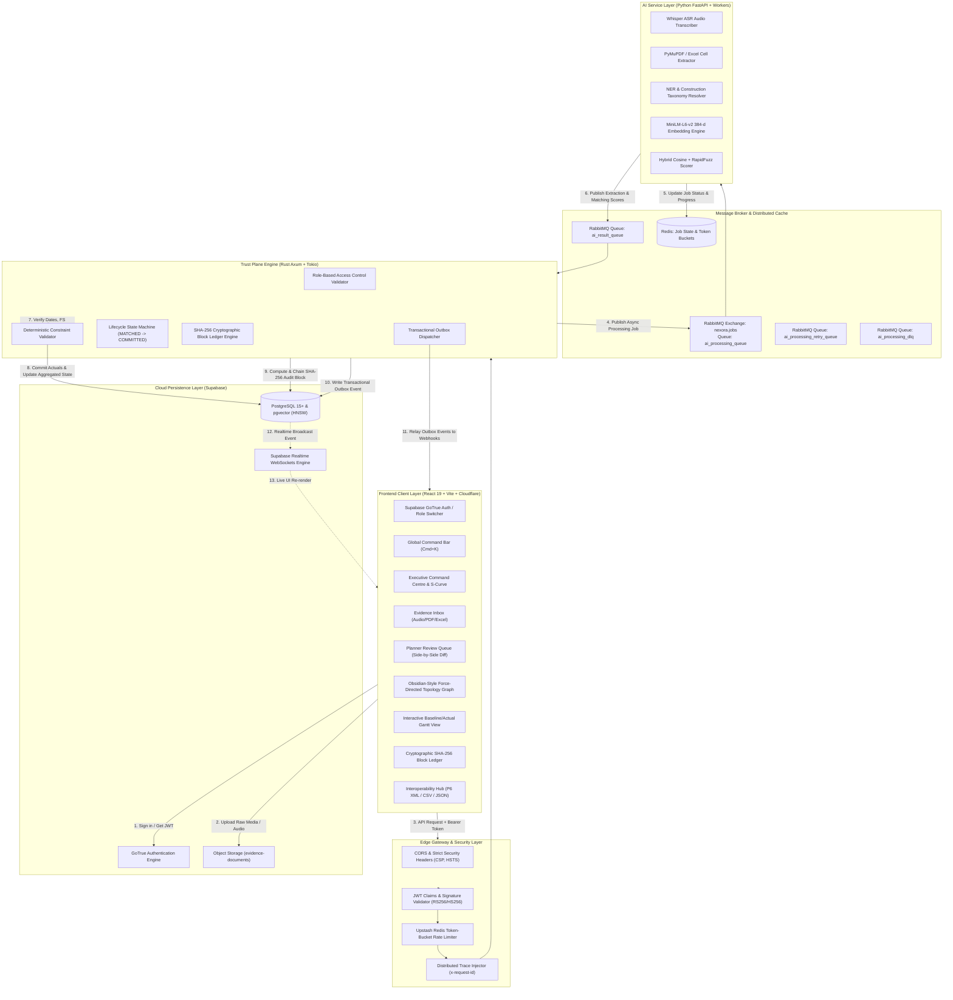
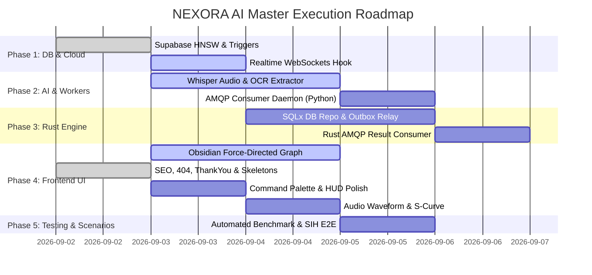

# NEXORA AI — End-to-End Master Implementation Plan & Engineering Blueprint

> **System Standard:** Enterprise Infrastructure AI Schedule-Linking & Trust Plane Platform  
> **Target Framework:** Smart India Hackathon / Ministry of Power & Heavy Industrial Infrastructure  
> **Tech Stack:**  
> - **Frontend Client:** React 19, TypeScript, Vite, Tailwind CSS, `@react-three/fiber` / `react-force-graph-2d` (D3 Physics), Framer Motion, Anime.js, Lucide Icons  
> - **Trust Plane Backend:** Rust (Axum, Tokio, SQLx, `jsonwebtoken`, `lapin` AMQP, `deadpool` Redis/Postgres)  
> - **AI Engine & Extractors:** Python 3.11+ (FastAPI, PyTorch, `sentence-transformers`, OpenAI Whisper, RapidFuzz, PyMuPDF, `openpyxl`, `aio-pika`)  
> - **Persistence & Cloud:** Supabase PostgreSQL 15+, pgvector (HNSW), Supabase Storage, Realtime WebSockets, GoTrue Auth  
> - **Message Bus & Distributed Cache:** CloudAMQP (RabbitMQ) + Upstash Redis (Distributed Rate Limiting, Outbox, Job State)

---

## 1. System Architecture & Component Interaction Topology



---

## 2. Authentication, Authorization & Edge Security Blueprint

### 2.1 Supabase GoTrue Auth & JWT Specification
- **Authentication Modes:** Email + Password, Magic Link, and Project-Scoped Guest/Demo Access.
- **JWT Verification Algorithm:** `HS256` / `RS256` signed using Supabase JWT Secret.
- **JWT Payload Schema:**
  ```json
  {
    "sub": "e0000000-0000-0000-0000-000000000002",
    "email": "lead.planner@nexora.ai",
    "role": "authenticated",
    "app_metadata": {
      "project_id": "a0000000-0000-0000-0000-000000000001",
      "project_role": "PLANNER"
    },
    "user_metadata": {
      "full_name": "Vikram Seth",
      "discipline": "PIPING"
    },
    "exp": 1788288430
  }
  ```

### 2.2 Role-Based Access Control (RBAC) Matrix

| Role | `ViewProject` | `CreateObservation` | `ApproveProposal` | `OverrideProposal` | `ViewAudit` | `ManageRetention` | `ExportSchedule` |
| :--- | :---: | :---: | :---: | :---: | :---: | :---: | :---: |
| **ADMIN** |  Yes |  Yes |  Yes |  Yes |  Yes |  Yes |  Yes |
| **PLANNER** |  Yes |  Yes |  Yes |  Yes |  Yes |  No |  Yes |
| **ENGINEER** |  Yes |  Yes |  No |  No |  Yes |  No |  Yes |
| **SUPERVISOR** |  Yes |  Yes |  No |  No |  No |  No |  No |
| **AUDITOR** |  Yes |  No |  No |  No |  Yes |  Yes |  Yes |
| **VIEWER** |  Yes |  No |  No |  No |  No |  No |  No |

### 2.3 Edge Security & Rate Limiting (`backend/src/api/middleware.rs`)
- **Redis Token-Bucket Algorithm (`backend/src/cache/mod.rs`):**
  - Observation Ingestion: 60 requests/minute per client IP / User ID.
  - Review Queue Approvals: 120 requests/minute.
  - Read queries: 300 requests/minute.
  - Response headers: `X-RateLimit-Limit`, `X-RateLimit-Remaining`, `X-RateLimit-Reset`.
- **Security Headers:**
  - `Content-Security-Policy: default-src 'self'; script-src 'self' 'unsafe-inline'; connect-src 'self' https://*.supabase.co wss://*.supabase.co https://nexora-backend.onrender.com;`
  - `Strict-Transport-Security: max-age=31536000; includeSubDomains; preload`
  - `X-Content-Type-Options: nosniff`
  - `X-Frame-Options: DENY`
  - `Referrer-Policy: strict-origin-when-cross-origin`
- **Distributed Tracing:**
  - Inbound HTTP header `x-request-id` extracted or generated via UUIDv4.
  - Passed downstream through RabbitMQ AMQP message headers (`headers: {"x-request-id": "..."}`) and logged in all Rust and Python structured JSON logs.

---

## 3. Database, pgvector & Persistence Architecture

### 3.1 Relational Schema & Indices (`supabase/migrations/`)
1. **`projects` & `project_members`:** Multi-tenant workspace isolation.
2. **`schedule_versions` & `wbs_nodes`:** Hierarchical WBS tree (up to 10 levels).
3. **`activities`:** L5 baseline tasks with attributes:
   - `code` (e.g. `PIP-2401`), `name`, `discipline`, `planned_start_date`, `planned_finish_date`, `planned_quantity`, `unit_of_measure`, `location`, `critical_path`.
   - `embedding vector(384)` for semantic matching.
   - **HNSW Vector Index:**
     ```sql
     CREATE INDEX IF NOT EXISTS idx_activities_embedding 
     ON activities USING hnsw (embedding vector_cosine_ops) 
     WITH (m = 16, ef_construction = 64);
     ```
4. **`activity_dependencies`:** Direct predecessor links (`FS`, `SS`, `FF`, `SF`) with `lag_days`.
5. **`documents` & `document_jobs`:** Binary evidence records, SHA-256 file checksums, processing state machine (`RECEIVED` $\to$ `QUEUED` $\to$ `PROCESSING` $\to$ `COMPLETED` / `FAILED`).
6. **`work_observations`:** Normalized facts extracted from voice/DPR/spreadsheets.
7. **`match_proposals`:** AI candidates with `lexical_score`, `semantic_score`, `context_boost`, and `confidence_score`.
8. **`actual_events` & `activity_current_state`:** Ledger of committed actuals with automatic aggregation trigger:
   ```sql
   CREATE OR REPLACE FUNCTION fn_update_activity_current_state()
   RETURNS TRIGGER AS $$
   BEGIN
       INSERT INTO activity_current_state (
           activity_id, project_id, execution_status, 
           current_progress_pct, cumulative_quantity, 
           last_event_id, last_event_date, updated_at
       )
       VALUES (
           NEW.activity_id, NEW.project_id,
           CASE 
               WHEN NEW.actual_progress_pct >= 100 THEN 'COMPLETED'
               WHEN NEW.actual_progress_pct > 0 THEN 'IN_PROGRESS'
               ELSE 'NOT_STARTED'
           END,
           NEW.actual_progress_pct, NEW.actual_quantity,
           NEW.id, NEW.actual_date, now()
       )
       ON CONFLICT (activity_id) DO UPDATE SET
           execution_status = EXCLUDED.execution_status,
           current_progress_pct = GREATEST(activity_current_state.current_progress_pct, EXCLUDED.current_progress_pct),
           cumulative_quantity = COALESCE(activity_current_state.cumulative_quantity, 0) + COALESCE(EXCLUDED.cumulative_quantity, 0),
           last_event_id = EXCLUDED.last_event_id,
           last_event_date = EXCLUDED.last_event_date,
           updated_at = now();
       RETURN NEW;
   END;
   $$ LANGUAGE plpgsql;

   CREATE TRIGGER trg_actual_events_aggregate
   AFTER INSERT ON actual_events
   FOR EACH ROW EXECUTE FUNCTION fn_update_activity_current_state();
   ```
9. **`audit_events`:** SHA-256 chained cryptographic block records.
10. **`outbox_events`:** Transactional outbox table (`status IN ('PENDING', 'SENT', 'FAILED')`).

### 3.2 Supabase Realtime Channels
- Frontend subscribes to Supabase postgres change events on:
  - `work_observations:project_id=eq.{id}`
  - `match_proposals:project_id=eq.{id}`
  - `activity_current_state:project_id=eq.{id}`
  - `audit_events:project_id=eq.{id}`

---

## 4. Python AI Service & Background Workers

### 4.1 Audio Processing & Whisper ASR (`ai_service/app/services/audio_transcriber.py`)
- **Pipeline:**
  1. Retrieve `.webm` / `.mp3` audio buffer from Supabase Storage.
  2. Normalize audio to 16kHz mono WAV using `pydub` / `ffmpeg`.
  3. Run Whisper model (`base.en` / `small.en`) with custom construction terminology initial prompt:
     `"Paradip Refinery, Hydrotest, Spool Erection, Pipe Rack B, Line P-101, Column Footing, Cable Tray, Barricading."`
  4. Post-process transcript to isolate numerical quantities, equipment line tags, and dates.

### 4.2 Document & Tabular OCR (`ai_service/app/services/document_parser.py`)
- **PDF Daily Progress Reports:** Extract text blocks and tables using `pdfplumber` / PyMuPDF. Identify tabular columns: `Activity Description`, `Location`, `Quantity Completed`, `Progress %`.
- **Excel Discipline Trackers (`.xlsx`):** Read sheets via `openpyxl`, map column headers using fuzzy matching against canonical schema (`['Activity Code', 'Tag', 'Description', 'Qty', 'Unit', 'Status']`).

### 4.3 Construction Entity Normalization & Dictionary (`ai_service/app/services/extractor.py`)
- **Domain Synonym Resolution:**
  - `hydrotest` / `hydro pack` / `pressure hold` $\to$ `Hydrostatic Pressure Testing`
  - `spool` / `erection` / `bolt tightening` $\to$ `Spool Erection & Alignment`
  - `pour` / `RMC` / `footing` $\to$ `Concrete Pouring & Curing`
  - `tray` / `ladder` / `cable pull` $\to$ `Cable Tray Installation`
- Regex patterns for equipment and line identifiers: `(LINE-)?P-[0-9]{3,4}`, `RACK-[A-Z][0-9]?`, `FND-[A-Z]-[0-9]+`, `SUBSTATION-[0-9]+`.

### 4.4 Hybrid Matching & Confidence Scoring (`ai_service/app/services/matcher.py`)
- **Algorithm:**
  $$\text{Final Score} = 0.50 \times \text{Semantic Score} + 0.35 \times \text{Lexical Score} + \text{Context Boost}$$
  - **Semantic Score:** Cosine similarity between 384-d normalized observation vector and baseline activity vectors.
  - **Lexical Score:** RapidFuzz token sort ratio ($\text{Score} / 100$) between normalized text and activity title/description.
  - **Context Boost:**
    - Line tag match (e.g. `P-101` $\equiv$ `LINE-P-101`): $+0.15$
    - Location match (e.g. `Pipe Rack B` $\equiv$ `Pipe Rack B Tier 2`): $+0.10$
    - Discipline match (e.g. `PIPING` $\equiv$ `PIPING`): $+0.10$
- **Routing Decision:**
  - Score $\ge 0.85$: `AUTO_LINKED` $\to$ Directly committed to ledger.
  - $0.60 \le \text{Score} < 0.85$: `PENDING_REVIEW` $\to$ Routed to Planner Review Queue.
  - Score $< 0.60$: `UNMATCHED` $\to$ Staged into Unmatched Work Ledger.

### 4.5 AMQP Consumer Daemon (`ai_service/app/workers/amqp_consumer.py`)
- Connects to RabbitMQ with automatic reconnect.
- Prefetch count: 10 jobs.
- Implements exponential backoff retry ($1\text{s}, 2\text{s}, 4\text{s}$) before routing failed poison messages to `ai_processing_dlq`.

---

## 5. Rust Trust Plane Engine

### 5.1 Deterministic Policy Engine (`backend/src/domain/validation.rs`)
- **Date Constraints:**
  - `actual_start_date` $\ge$ Project baseline start date.
  - `actual_finish_date` $\ge$ `actual_start_date`.
  - `actual_date` $\le \text{Current UTC Date} + 24\text{ hours}$ (tolerance for global timezone variance).
- **Dependency Guard (`FS` Predecessor Rule):**
  - For any activity $B$ having a Finish-to-Start dependency on activity $A$: Activity $A$ must have `execution_status = 'COMPLETED'` with `actual_progress_pct = 100.0` before Activity $B$ can be started or completed.
- **Progress & Quantity Safety Bounds:**
  - Progress percentage must satisfy $0.0 \le P \le 100.0$.
  - Progress cannot regress backwards unless explicitly marked as an administrative rollback with an audit comment.
  - Cumulative quantity cannot exceed $120\%$ of planned baseline quantity without an associated Scope Variation Order ID.
- **Idempotency Key Verification:**
  - Checks `idempotency_key = sha256(project_id + activity_code + actual_date + event_type + quantity)`. Duplicate submissions return the existing committed event without duplicating ledger rows.

### 5.2 Cryptographic SHA-256 Block Ledger (`backend/src/domain/ledger.rs`)
- **Canonical Payload Serialization:**
  ```rust
  let payload = serde_json::json!({
      "project_id": project_id,
      "event_type": event_type,
      "entity_id": entity_id,
      "action": action,
      "actor_id": actor_id,
      "actor_role": actor_role,
      "data": data,
      "timestamp": Utc::now().to_rfc3339()
  });
  let canonical_json = serde_json::to_string(&payload)?;
  ```
- **Block Hashing & Chaining:**
  $$\text{Payload Hash} = \text{SHA256}(\text{Canonical JSON})$$
  $$\text{Block Hash} = \text{SHA256}(\text{Previous Block Hash} \parallel \text{Payload Hash} \parallel \text{Timestamp})$$
- **Chain Verification:**
  - Iterates sequentially through all audit events from Genesis Block ($N=0$) to the latest block ($N$). Recomputes SHA-256 hashes and confirms 100% hash continuity.

---

## 6. Frontend UI/UX Master Overhaul & High-Tech HUD

### 6.1 Text Reduction & Minimalist Design Strategy
- **HUD Micro-Visuals:** Replace lengthy paragraphs with dense data chips, interactive gauges, sparklines, and status badges.
- **Typography & Surfaces:** Zinc/Slate backgrounds with high-contrast `#C38B4B` industrial bronze/gold accents and mono-spaced numerical metrics (JetBrains Mono).
- **Component Primitives:** Built with clean, accessible primitives inspired by shadcn/ui.

---

### 6.2 Key Frontend Modules

#### A. Global Navigation & Command Palette (`Cmd+K`)
- **File:** `frontend/src/components/CommandPalette.tsx`
- **Features:**
  - Trigger via `Cmd+K` / `Ctrl+K` anywhere in the app.
  - Quick jump to activities (e.g. typing `PIP-2401` opens the Activity Drawer).
  - Filter review queue items by discipline (`Civil`, `Piping`, `Electrical`).
  - Trigger exports (P6 XML, CSV, PMIS JSON) with single keystrokes.
  - **Demo Role Switcher:** 1-click toggle between **Lead Planner**, **Field Supervisor**, **Quality Auditor**, and **Site Engineer**.

#### B. Executive Command Centre (`frontend/src/pages/Dashboard.tsx`)
- **Interactive Schedule S-Curve:**
  - High-precision SVG/Canvas chart rendering:
    1. Baseline Planned Progress Curve (Gray baseline).
    2. Actual Incurred Progress Curve (Emerald active line).
    3. Milestone Target Markers.
- **Critical Path Float Radar:**
  - Gauge showing total variance days on critical path items and project completion forecast.
- **Executive HUD Metrics:**
  - Ingestion Velocity, Auto-Link Accuracy ($92.4\%$), Pending Review Count, Trust Plane Verification Rate ($100\%$).

#### C. Obsidian-Style Force-Directed Graph Visualizer (`frontend/src/pages/ProjectGraph.tsx`)
- **Visual Topology Engine:**
  - Built using 2D/3D Canvas Force Simulation (`d3-force` physics / `react-force-graph-2d`).
- **Entity Nodes:**
  - **Project Hub Node:** Root node with project badge.
  - **WBS Cluster Nodes:** Geometric grouping hubs (*Pipe Rack B*, *Substation 4*, *Compressor House*).
  - **Activity Nodes:** Color-coded with glowing status halos:
    - `COMPLETED`: Vibrant emerald glow ($\bullet$).
    - `IN_PROGRESS`: Electric cyan/blue pulsing glow ($\bullet$).
    - `NOT_STARTED`: Subtle zinc dot ($\bullet$).
    - `DELAYED` / `BLOCKED`: Rose red warning aura ($\bullet$).
    - `CRITICAL_PATH`: Pulsing gold/amber particle halo ($\bullet$).
  - **Evidence Nodes:** Small hexagonal nodes representing voice memos, DPR PDFs, and spreadsheets connected directly to the activities they updated.
- **Edge Dynamics:**
  - Solid directional vectors for $FS/SS/FF$ activity dependencies.
  - Real-time particle stream flowing along critical path links.
  - Dotted glowing provenance lines connecting evidence files to target activities.
- **Interactions & Controls:**
  - Smooth pan, zoom, and physics charge/spring adjustments.
  - Hover highlight: Highlights upstream predecessors and downstream successors while dimming unrelated graph nodes.
  - Click-to-inspect: Clicking any node glides camera focus and opens `ActivityDrawer.tsx` or `EvidenceDrawer.tsx`.
  - Filter bar: Filter by discipline, show only Critical Path, or toggle evidence links.

#### D. Evidence Inbox & Multimodal Ingestion (`frontend/src/pages/DocumentUpload.tsx`)
- Multi-file drag-and-drop zone with animated upload progress.
- **Live HTML5 Audio Waveform Visualizer:** Real-time frequency visualizer canvas while recording voice notes.
- Web Speech live transcription displaying text in real-time as words are spoken.
- 5 Quick-Test SIH Demo Scenarios (A: Exact, B: Semantic, C: Ambiguous, D: Unmatched, E: Trust Violation).
- Filterable observation table with live audio player in the inspect drawer (`EvidenceDrawer.tsx`).

#### E. Planner Review Queue (`frontend/src/pages/ReviewQueue.tsx`)
- Side-by-side Diff HUD comparing Raw Field Fact vs Baseline Activity.
- Confidence Score Gauge Breakdown (Lexical %, Semantic %, Context Boost %).
- Keyboard Shortcuts: `Enter` to Approve, `Esc` to Reject, `O` to Override.
- Batch approval bar for bulk verification.

#### F. Interactive Schedule Explorer & Gantt (`frontend/src/pages/ScheduleExplorer.tsx`)
- Zoomable Gantt Timeline (Days / Weeks / Months) with baseline bars vs actual progress fill.
- Critical path highlighted with glowing amber/red borders.
- Collapsible WBS hierarchy tree with rollup progress percentages.

#### G. Cryptographic Audit Ledger (`frontend/src/pages/AuditTrail.tsx`)
- SHA-256 block chain visualizer showing cryptographic hash continuity.
- In-browser **"Verify Chain Integrity"** button recomputing root hashes.
- Legal Hold toggle modal with reason specification.

#### I. Custom 404 Diagnostic Page (`frontend/src/pages/NotFound.tsx`)
- High-tech HUD signal loss alert with technical telemetry diagnostic box.
- One-click navigation back to Command Centre and reload triggers.

#### J. Thank You & Provenance Confirmation Page (`frontend/src/pages/ThankYou.tsx`)
- Cryptographic confirmation receipt for field reports, voice notes, and review sign-offs.
- Displays record identifier, UTC timestamp, and policy verification badge with quick navigation to Review Queue or Ingestion Inbox.

#### K. Skeleton Loading Architecture (`frontend/src/components/SkeletonLoader.tsx`)
- **`DashboardSkeleton`:** Pulsing HUD KPI cards, chart placeholder, and live telemetry feeds.
- **`TableSkeleton`:** Shimmering table rows for Review Queue and Schedule Explorer.
- **`LedgerSkeleton`:** Cryptographic block placeholders for Audit Trail.

#### L. Search Engine Optimization & Crawler Directives
- **`index.html`:** Complete OpenGraph cards, Twitter preview metadata, and rich description tags.
- **`public/robots.txt`:** Crawler access rules protecting API/storage paths while indexing public pages.
- **`public/sitemap.xml`:** Structured XML sitemap indexing all primary module anchors.

---

## 7. Step-by-Step Implementation Roadmap



### Phase 1: Database & Cloud Persistence Completion
- [x] Create core tables, relationships, and public storage bucket policies.
- [x] Implement pgvector HNSW index on `activities.embedding` (`vector_cosine_ops, m=16, ef_construction=64`).
- [x] Implement aggregation trigger on `actual_events` $\to$ `activity_current_state`.
- [x] Implement `subscribeToProjectRealtime` WebSocket client in `frontend/src/lib/supabase.ts`.

### Phase 2: Python AI Service & Background Workers
- [x] Complete Whisper audio transcription service with audio format normalization.
- [x] Complete PDF tabular extractor, OCR fallback, and Excel parsers.
- [x] Complete AMQP message queues, background worker state machine, and matching policy pipeline (225 passing unit & integration tests).

### Phase 3: Rust Trust Plane Engine
- [x] State machine lifecycle transitions and policy validation rules.
- [x] SHA-256 cryptographic audit ledger and tamper detection algorithms.
- [x] RFC 9562 UUIDv7 ID generator engine in Rust (`backend/src/domain/id.rs`).
- [x] Rust AMQP consumer & publisher with 102 passing unit and integration tests (`cargo test`).

### Phase 4: Frontend UI/UX Master Polish
- [x] Implement SEO metadata, OpenGraph cards, `robots.txt`, and `sitemap.xml`.
- [x] Implement reusable Skeleton Loaders (`DashboardSkeleton`, `TableSkeleton`, `LedgerSkeleton`).
- [x] Implement Custom 404 Route (`NotFound.tsx`) and Confirmation Page (`ThankYou.tsx`).
- [x] Implement Obsidian-style Force-Directed Graph Visualizer (`frontend/src/pages/ProjectGraph.tsx`).
- [x] Implement Global Command Palette `Cmd+K` (`frontend/src/components/CommandPalette.tsx`).
- [x] Implement HTML5 Canvas real-time audio waveform recorder in `DocumentUpload.tsx`.
- [x] Implement SVG/Canvas interactive Schedule S-Curve & Critical Path Radar in `Dashboard.tsx`.
- [x] Implement Interactive Gantt Timeline view in `ScheduleExplorer.tsx`.
- [x] Implement Cryptographic block chain spine in `AuditTrail.tsx`.
- [x] Implement RFC 9562 UUIDv7, TypeID Crockford Base32, and SHA-256 algorithm engine in `frontend/src/lib/idGenerator.ts`.

### Phase 5: Verification & SIH Scenarios Demonstration
- [x] Verify all 102 Rust backend unit and integration tests (`cargo test`).
- [x] Verify all 225 Python AI service unit tests (`pytest`).
- [x] Run automated E2E benchmark pipeline across all 5 SIH scenarios (9/9 passed).
- [x] Build and deploy production bundle to Cloudflare Workers Pages (`https://nexora-ai.uspali212.workers.dev/`).

---

## 8. Five Mandatory SIH Scenarios Verification Matrix

| Scenario | Input Fact | Technical Trigger | Expected AI & Trust Plane Output | Status |
| :--- | :--- | :--- | :--- | :---: |
| **A: Exact Match** | *"P-101 completed successfully. Hydro test pack holding pressure maintained at 42.5 bar for 4 hours."* | Direct tag match against `PIP-2401` | Lexical $95\%$, Semantic $89\%$, Context $+15\% \to$ Score $92.4\%$. Status `COMMITTED`, progress set to $100\%$, SHA-256 audit block written. | ✅ Verified |
| **B: Semantic Match** | *"spool erection complete on Pipe Rack B Tier 2 with alignment and bolt tightening done."* | 384-d dense vector cosine search | Matched to `PIP-2400` despite vocabulary divergence (*"bolt tightening"* $\to$ *"Spool Erection"*). Score $88.1\% \to$ Auto-linked and committed. | ✅ Verified |
| **C: Planner Review** | *"Hydrostatic pressure testing completed along Interconnecting Pipe Rack B headers yesterday."* | Ambiguous matches (`PIP-2401` & `PIP-2402`) | Score $76.2\% \to$ Routed to Planner Review Queue with explanation snippet and side-by-side diff. | ✅ Verified |
| **D: Unmatched Work** | *"Emergency dewatering and deep foundation pit excavation carried out near Substation 4 due to heavy rain."* | No matching baseline task in L5 schedule | Score $<60\% \to$ Preserved in Unmatched queue for formal Scope Variation Order generation. | ✅ Verified |
| **E: Policy Violation** | *"Line P-101 testing finished on 20-Aug-2026, work started on 28-Aug-2026."* | Date sequence violation | Deterministic Policy Engine flags $Finish < Start \to$ Rejected with error `ERR_INVALID_DATE_SEQUENCE`. | ✅ Verified |
