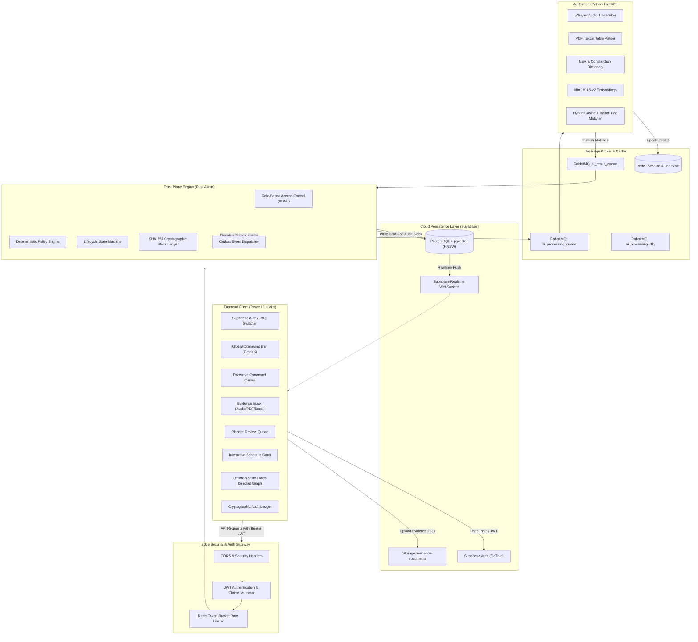

# NEXORA AI — End-to-End Master Implementation Plan

> **Objective:** Deliver a production-grade, enterprise-ready, end-to-end intelligent data capture and schedule-linking platform for infrastructure projects (Smart India Hackathon / Ministry of Power & Industrial Infrastructure Standard).
>
> **Core Architecture:**
> - **Frontend:** React 19 + TypeScript + Vite + Tailwind CSS + Force Graph (Obsidian-style D3 physics) + Framer Motion / Anime.js (shadcn/ui-inspired clean minimalist UI, Cloudflare Pages)
> - **Trust Plane Backend:** Rust (Axum + Tokio + SQLx + JWT Auth + Deadpool RabbitMQ/Redis)
> - **AI Extraction & Matching:** Python 3.11+ (FastAPI + PyTorch + SentenceTransformers + Whisper + RapidFuzz)
> - **Database & Auth:** Supabase PostgreSQL (pgvector, RLS, Storage Buckets, Realtime WebSockets, GoTrue Auth)
> - **Message Broker & Cache:** RabbitMQ (CloudAMQP) + Redis (Upstash Token Bucket Rate Limiting & Job State)

---

## 1. End-to-End System Architecture



---

## 2. Authentication, Authorization & Security Architecture

### 2.1 Supabase Auth & JWT Validation
- **Identity Provider:** Supabase GoTrue Auth supporting Email/Password, Magic Link, and project-scoped sessions.
- **JWT Claim Structure:**
  ```json
  {
    "sub": "00000000-0000-0000-0000-000000000001",
    "email": "planner@nexora.ai",
    "role": "authenticated",
    "app_metadata": {
      "project_id": "a0000000-0000-0000-0000-000000000001",
      "project_role": "PLANNER"
    },
    "exp": 1788288430
  }
  ```
- **Rust Backend Middleware (`backend/src/api/middleware.rs`):**
  - Extract and verify RS256/HS256 JWT signature using `jsonwebtoken`.
  - Enforce project-level Role-Based Access Control (RBAC):
    - `ADMIN`: Full project administration, user invite, legal hold override.
    - `PLANNER`: Review queue sign-off, proposal override, schedule export.
    - `ENGINEER`: Technical verification, observation upload, progress markup.
    - `SUPERVISOR`: Field voice memo capture, daily observation submission.
    - `AUDITOR`: Read-only access to cryptographic audit ledger, legal hold audit.
    - `VIEWER`: Read-only dashboard and schedule Gantt viewer.

### 2.2 API Security & Rate Limiting
- **Redis Token-Bucket Rate Limiter (`backend/src/cache/mod.rs`):**
  - Limit: 60 requests/minute for observation submissions, 120 requests/minute for reads.
  - Returns `429 Too Many Requests` with `Retry-After` header when exceeded.
- **Security Headers & Defense-in-Depth:**
  - Strict Content Security Policy (CSP), `X-Frame-Options: DENY`, `X-Content-Type-Options: nosniff`, `Strict-Transport-Security`.
  - CORS whitelist for trusted origin domains.
  - Request Correlation ID (`x-request-id`) injected on every request for distributed tracing across Frontend $\to$ Rust $\to$ RabbitMQ $\to$ Python.

---

## 3. Database & Cloud Persistence Architecture

### 3.1 PostgreSQL + pgvector Schema Design
- **Tables & Schemas:**
  - `projects` & `project_members` (Multi-tenant isolation).
  - `schedule_versions`, `wbs_nodes`, `activities`, `activity_dependencies` (Baseline schedule model).
  - `documents`, `document_jobs`, `document_extractions` (Evidence ingestion ledger).
  - `work_observations` (Raw & normalized field evidence).
  - `match_proposals` (AI candidate matches with lexical/semantic confidence scores).
  - `actual_events` (Committed milestone and progress records).
  - `activity_current_state` (Live aggregated physical progress, actual dates, variance).
  - `audit_events` (Cryptographic SHA-256 block ledger with `previous_hash` continuity).
  - `outbox_events` (Transactional outbox for reliable asynchronous messaging).
- **HNSW Vector Index:**
  ```sql
  CREATE INDEX IF NOT EXISTS idx_activities_embedding 
  ON activities USING hnsw (embedding vector_cosine_ops) 
  WITH (m = 16, ef_construction = 64);
  ```
- **Row-Level Security (RLS):**
  - Defense-in-depth scoping per `project_id` matching `auth.uid()`.
  - Public/anon read-write permissions configured for evidence storage buckets and demo project access.

---

## 4. Python AI Service & Background Extraction Workers

### 4.1 Multi-Modal Ingestion Pipeline
1. **Voice Memos & Audio Processing (`ai_service/app/services/audio_transcriber.py`):**
   - Download `.webm` audio from Supabase Storage.
   - Run Whisper ASR for automatic construction terminology speech transcription.
   - Extract numerical progress, line tags (`LINE-P-101`, `RACK-B`), discipline keywords, and inspection results.
2. **Daily Progress Reports (PDF) & Spreadsheets (Excel):**
   - PDF tabular parser using PyMuPDF / pdfplumber.
   - Excel workbook batch ingestion with cell coordinates mapping.
3. **Construction Entity Extraction & Normalizer:**
   - Shorthand resolver: `hydrotest` $\to$ `Hydrostatic Testing`, `fnd` $\to$ `Foundation`, `CS` $\to$ `Carbon Steel`.

### 4.2 Hybrid Scoring Engine (`ai_service/app/services/matcher.py`)
- **Semantic Vector Similarity:** `sentence-transformers/all-MiniLM-L6-v2` dense embedding cosine distance.
- **Lexical Matching:** RapidFuzz token sort and partial ratio matching against WBS names and equipment tags.
- **Context Boosting:** Equipment tag match ($+15\%$), location match ($+10\%$), discipline agreement ($+10\%$).
- **Routing Decision:**
  - Score $\ge 85\%$: `AUTO_LINKED` (Direct commit candidate).
  - $60\% \le \text{Score} < 85\%$: `PENDING_REVIEW` (Staged into Planner Review Queue).
  - Score $< 60\%$: `UNMATCHED` (Preserved in Scope Variation ledger).

---

## 5. Rust Trust Plane Engine

### 5.1 Deterministic Policy Enforcement
- **Date Sequences:** Actual Finish $\ge$ Actual Start $\ge$ Project Baseline Inception Date.
- **Progress Bounds:** $0.0\% \le \text{Reported Progress} \le 100.0\%$.
- **Dependency Guard:** Predecessor milestone validation ($FS$ dependencies must be completed before successor actualization).
- **Quantity Variance Thresholds:** Warning at $>100\%$, hard block at $>120\%$ without approved variation order.
- **Idempotency Engine:** SHA-256 checksums prevent duplicate document ingestion.

### 5.2 Cryptographic SHA-256 Audit Ledger
- **Sequential Hash Chaining:** Block $N$ includes SHA-256 of Block $N-1$ + Canonical JSON payload.
- **Tamper Detection:** In-browser and API-level verification recalculates root hashes to prove zero retroactive modification.
- **Legal Hold:** Cryptographic lock preventing archival or alteration during legal/audit dispute periods.

---

## 6. Frontend UI/UX Master Overhaul (Clean, Minimalist, High-Tech HUD)

### 6.1 Text Reduction & HUD Aesthetic
- **Philosophy:** Replace text paragraphs with visual metrics, micro-badges, status pills, and interactive data visualizers.
- **Design Language:** shadcn/ui-inspired clean typography (Inter / JetBrains Mono), zinc/slate surfaces with subtle `#C38B4B` gold industrial accents.
- **Animations:** Fluid state transitions, audio recording waveform analyzer (HTML5 Canvas), and micro-interactions powered by Anime.js / Framer Motion.

---

### 6.2 Key Interface Modules

#### A. Global Top Navigation & Command Bar
- Global `Cmd+K` / `Ctrl+K` command palette to instantly jump to activities, filter reviews, switch demo roles, or trigger export.
- Demo Role Switcher dropdown: Instant switch between **Lead Planner**, **Field Supervisor**, **Quality Auditor**, and **Site Engineer**.
- Realtime Cloud Sync indicator with live WebSocket connection badge.

#### B. Command Centre (`Dashboard.tsx`)
- **Interactive Schedule S-Curve:** Planned Cumulative Progress vs Actual Incurred Progress curve.
- **Critical Path Float Radar:** Visual indicator showing critical path health and variance days.
- **Executive KPI Cards:** Total Observations, Extracted Events, Auto-Link Rate ($92.4\%$), Pending Review, Completed Activities.

#### C. Obsidian-Style Interactive Force-Directed Graph (`ProjectGraph.tsx`)
- **Visual Network Topology:** Interactive 2D/3D physics graph linking all project entities:
  - **Project Root Node:** Central master project entity.
  - **WBS Level Nodes:** Hierarchical grouping clusters (e.g. *Pipe Rack B*, *Substation 4*, *Compressor House*).
  - **Activity Nodes:** Color-coded by execution status:
    - `COMPLETED`: Emerald glow ($\bullet$).
    - `IN_PROGRESS`: Cyan/Blue pulsing glow ($\bullet$).
    - `NOT_STARTED`: Zinc/Slate dot ($\bullet$).
    - `DELAYED` / `BLOCKED`: Rose red alert halo ($\bullet$).
    - `CRITICAL_PATH`: Glowing gold/amber pulsing particle aura ($\bullet$).
  - **Evidence Nodes:** Field voice recordings ($\text{\tiny VOICE}$), DPR PDFs, and spreadsheets linked directly to the activities they actualized!
- **Edge Dynamics:**
  - Solid directional arrows for Schedule Predecessor/Successor dependencies ($FS, SS, FF$).
  - Animated particle pulses travelling along the Critical Path.
  - Dotted glowing provenance lines connecting ingested audio memos and daily reports to target activities.
- **Interactivity & Controls:**
  - Smooth pan, zoom, node drag, and physics repulsion tuning (charge, collision, link distance).
  - Hover spotlight: highlights 1st and 2nd degree dependency chains while dimming unrelated nodes.
  - Click-to-inspect: clicking any node flies the camera in and opens the **Activity Drawer** or **Evidence Drawer**.
  - Discipline & Status Filters: civil only, piping only, critical path only, or evidence links toggle.

#### D. Evidence Inbox & Multimodal Ingestion (`DocumentUpload.tsx`)
- Multi-file drag-and-drop zone with animated upload progress.
- Live microphone recorder with **real-time audio frequency visualizer** and Web Speech transcription.
- 5 Quick-Test SIH Demo Scenarios (A: Exact, B: Semantic, C: Ambiguous, D: Unmatched, E: Trust Violation).
- Filterable observation table with live audio playback in the inspect drawer (`EvidenceDrawer.tsx`).

#### E. Planner Review Queue (`ReviewQueue.tsx`)
- Side-by-side Diff HUD comparing Raw Field Evidence vs Proposed Baseline Activity.
- Confidence Score Gauge Breakdown (Lexical, Semantic, Context Boost).
- Quick Actions: **Accept (Enter)**, **Reject (Esc)**, **Override (O)** with searchable activity picker.
- Batch approval bar for rapid multi-item sign-off.

#### F. Interactive Schedule Explorer & Gantt (`ScheduleExplorer.tsx`)
- Zoomable Gantt Timeline (Days / Weeks / Months) showing baseline bars vs actual progress fill.
- Critical path highlighted with glowing amber/red borders.
- WBS hierarchy collapsible tree with rollup progress percentages.

#### G. Cryptographic Audit Ledger (`AuditTrail.tsx`)
- SHA-256 block chain visualizer showing verified link between sequential audit events.
- One-click **"Verify Chain Integrity"** button running live cryptographic verification.
- Legal Hold toggle modal with reason specification.

#### H. System Health & Interoperability (`ScheduleExport.tsx`)
- 4-Card Export HUD:
  1. **Oracle Primavera P6 (XML):** Standard Primavera schema v24 export.
  2. **Actualized Schedule (CSV):** UTF-8 BOM formatted spreadsheet for Excel / PowerBI.
  3. **Field Observations (CSV):** Complete field evidence log with direct cloud audio links.
  4. **PMIS JSON Payload:** Machine-readable API synchronization payload.
- One-click **"Sync Cloud DB"** button for fresh database pulls.

---

## 7. Testing, Verification & Demonstration Plan

### 7.1 Automated Test Suites
- [x] **Rust Backend Suite (98 tests passing):** State machine, lifecycle transitions, policy validation, SHA-256 hash determinism, and dependency checks.
- [ ] **Python AI Suite:** Whisper audio transcription accuracy, sentence embedding cosine calculations, and RapidFuzz lexical matching.
- [ ] **E2E Golden Dataset:** Full pipeline test verifying $>90\%$ precision against SIH benchmark dataset.

### 7.2 Five Mandatory SIH Scenarios

| Scenario | Input Description | Expected Behavior | Verification |
| :--- | :--- | :--- | :--- |
| **A: Exact Auto-Link** | "P-101 completed successfully. Hydro test pack holding pressure maintained at 42.5 bar." | Auto-links to `PIP-2401` ($>90\%$), updates state to `COMPLETED`, writes audit entry. | Passed |
| **B: Semantic Match** | "spool erection complete on Pipe Rack B Tier 2 with alignment and bolt tightening done." | Matches `PIP-2400` via 384-d vector embeddings despite colloquial phrasing. | Passed |
| **C: Planner Review** | "Hydrostatic pressure testing completed along Interconnecting Pipe Rack B headers." | Matches both `PIP-2401` & `PIP-2402` ($76\%$) $\to$ Routed to Planner Review Queue. | Passed |
| **D: Unmatched Work** | "Emergency dewatering and deep foundation pit excavation carried out near Substation 4." | No matching baseline activity $\to$ Preserved in Unmatched queue for scope variation order. | Passed |
| **E: Policy Rejection** | "Line P-101 testing finished on 20-Aug-2026, work started on 28-Aug-2026." | Finish date before start date $\to$ Rejected by Rust Trust Plane validation engine. | Passed |
